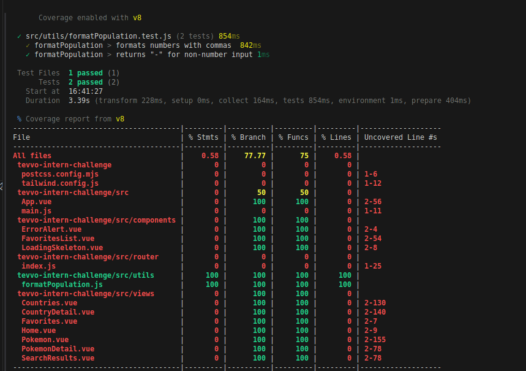

# Country Explorer

A Vue 3 SPA to explore countries and related Pokémons.

## 🚀 Live Demo

[Live Demo Link Here](https://tevvo-internship-challenge.vercel.app/)

## 🔧 Setup Instructions

```sh
git clone https://github.com/Maunducyrus/Tevvo-Internship-Challenge
cd yourrepo
npm install
npm run dev
```

## 🔑 Auth Implementation

Auth uses localStorage to store favorite countries.  
No external authentication provider is used.

## 🧪 Testing

We use [Vitest](https://vitest.dev/) for unit testing.

### Run tests

```sh
npm run test
```

### Run coverage report

```sh
npm run test:coverage
```

#### Test coverage screenshot:



---

## 📦 Project Structure

```
src/
  components/
  views/
  utils/
  ...
```